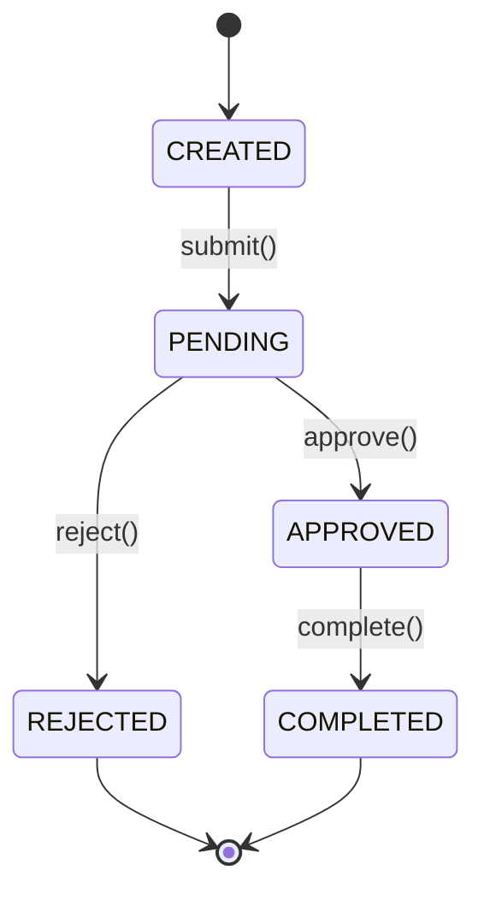

# [FEATURE-X.Y]: Feature Name

> **Module**: [Module Name]  
> **Related User Stories**: US-X.Y, US-X.Z  
> **Implementation Priority**: P0 | P1 | P2 | P3  
> **Status**: 📝 Design | 🚧 Development | 🧪 Testing | ✅ Released

---

## Feature Overview

### Description
[High-level description of what this feature does]

### Business Value
[Why this feature is important, what problem it solves]

### User Impact
[How this affects users, what they can now do]

---

## Related User Stories

| Story ID | Story Title | Status |
|----------|-------------|--------|
| US-X.Y | [Title] | ✅ Approved |
| US-X.Z | [Title] | 📝 Draft |

---

## Technical Architecture

### System Components
```
┌─────────────┐      ┌──────────────┐      ┌─────────────┐
│   Client    │─────▶│   Backend    │─────▶│  Database   │
│  (Web/App)  │      │  API Server  │      │             │
└─────────────┘      └──────────────┘      └─────────────┘
                            │
                            ▼
                     ┌──────────────┐
                     │ External API │
                     │   (if any)   │
                     └──────────────┘
```

### Technology Stack
- **Frontend**: [Framework/Library]
- **Backend**: [Framework/Language]
- **Database**: [Database type]
- **External Services**: [Third-party services]

---

## API Endpoints

### Endpoint 1: [Endpoint Name]
```yaml
method: POST
path: /api/v1/resource
description: [What this endpoint does]

authentication: 
  required: true
  type: Bearer Token
  roles: [USER, ADMIN]

request:
  headers:
    Content-Type: application/json
    Authorization: Bearer {token}
  
  body:
    type: object
    required: [field1, field2]
    properties:
      field1:
        type: string
        description: [Field description]
        example: "example value"
      field2:
        type: integer
        minimum: 1
        example: 42

response:
  success:
    status: 201
    body:
      id: uuid
      field1: string
      created_at: datetime (ISO 8601)
    example: |
      {
        "id": "123e4567-e89b-12d3-a456-426614174000",
        "field1": "example",
        "created_at": "2025-01-01T00:00:00Z"
      }
  
  errors:
    - status: 400
      code: INVALID_INPUT
      message: "Field validation failed"
      example: |
        {
          "error": "INVALID_INPUT",
          "message": "Field1 is required",
          "details": {"field": "field1"}
        }
    
    - status: 401
      code: UNAUTHORIZED
      message: "Authentication required"
    
    - status: 403
      code: FORBIDDEN
      message: "Insufficient permissions"
    
    - status: 409
      code: RESOURCE_EXISTS
      message: "Resource already exists"

rate_limiting:
  limit: 100 requests per minute
  scope: per user

caching:
  enabled: false
  ttl: N/A
```

### Endpoint 2: [Another Endpoint]
```yaml
method: GET
path: /api/v1/resource/{id}
description: [Description]
# ... (same structure as above)
```

### Endpoint 3: [Update Endpoint]
```yaml
method: PUT
path: /api/v1/resource/{id}
description: [Description]
# ... (same structure)
```

### Endpoint 4: [Delete Endpoint]
```yaml
method: DELETE
path: /api/v1/resource/{id}
description: [Description]
# ... (same structure)
```

---

## Data Models

### Entity: [EntityName]
```yaml
table_name: entities
description: [What this entity represents]

fields:
  id:
    type: uuid
    primary_key: true
    auto_generated: true
  
  field_name:
    type: string
    max_length: 255
    nullable: false
    unique: true
    index: true
  
  status:
    type: enum
    values: [ACTIVE, INACTIVE, PENDING]
    default: PENDING
  
  created_at:
    type: timestamp
    default: now()
  
  updated_at:
    type: timestamp
    auto_update: true

relationships:
  - type: has_many
    entity: RelatedEntity
    foreign_key: entity_id
  
  - type: belongs_to
    entity: ParentEntity
    foreign_key: parent_id

indexes:
  - name: idx_field_status
    fields: [field_name, status]
    unique: false

constraints:
  - type: check
    condition: status IN ('ACTIVE', 'INACTIVE', 'PENDING')
```

---

## Business Logic

### Validation Rules
```yaml
- rule: Email format validation
  condition: email must match RFC 5322 format
  error: INVALID_EMAIL_FORMAT
  
- rule: Age restriction
  condition: user.age >= 18
  error: AGE_RESTRICTION
  message: "User must be 18 or older"
```

### Processing Flow
```
1. Validate input data
   ├─ Check required fields
   ├─ Validate format/type
   └─ Apply business rules

2. Check permissions
   ├─ Verify authentication
   └─ Verify authorization

3. Process business logic
   ├─ [Specific processing step]
   ├─ [Another processing step]
   └─ [Final processing step]

4. Persist data
   ├─ Begin transaction
   ├─ Save to database
   └─ Commit transaction

5. Trigger side effects
   ├─ Send notifications
   ├─ Update related entities
   └─ Log events

6. Return response
```

### State Machine (if applicable)


---

## Error Handling

### Error Response Format
```json
{
  "error": {
    "code": "ERROR_CODE",
    "message": "Human-readable error message",
    "details": {
      "field": "field_name",
      "reason": "specific validation failure"
    }
  },
  "meta": {
    "timestamp": "2025-01-01T00:00:00Z",
    "request_id": "req_123456"
  }
}
```

### Error Codes Catalog

| Error Code | HTTP Status | Description | User Message | Retry |
|------------|-------------|-------------|--------------|-------|
| `INVALID_INPUT` | 400 | Request validation failed | "Please check your input" | No |
| `UNAUTHORIZED` | 401 | Not authenticated | "Please login" | No |
| `FORBIDDEN` | 403 | Insufficient permissions | "Access denied" | No |
| `NOT_FOUND` | 404 | Resource doesn't exist | "Resource not found" | No |
| `CONFLICT` | 409 | Resource already exists | "Already exists" | No |
| `RATE_LIMIT` | 429 | Too many requests | "Please try again later" | Yes |
| `SERVER_ERROR` | 500 | Internal server error | "Something went wrong" | Yes |

---

## Security Considerations

### Authentication
- [How users authenticate]
- [Token type and expiration]

### Authorization
- [Permission model]
- [Role-based access control]

### Data Protection
- [Sensitive data handling]
- [Encryption requirements]
- [PII/GDPR compliance]

### Input Validation
- [XSS prevention]
- [SQL injection prevention]
- [Input sanitization rules]

---

## Performance Requirements

### Response Time
- **Target**: [ms/s]
- **Maximum acceptable**: [ms/s]

### Throughput
- **Expected load**: [requests/second]
- **Peak load**: [requests/second]

### Scalability
- [Horizontal/vertical scaling strategy]
- [Load balancing approach]

### Database
- **Query optimization**: [Specific optimizations]
- **Indexing strategy**: [Index decisions]
- **Caching**: [What to cache, TTL]

---

## Testing Requirements

### Unit Tests
- [ ] Test [specific function/method]
- [ ] Test [validation logic]
- [ ] Test [error handling]

### Integration Tests
- [ ] Test [API endpoint flow]
- [ ] Test [database operations]
- [ ] Test [external service integration]

### E2E Tests (Gherkin)
```gherkin
Feature: [Feature Name]

  Scenario: [Happy path scenario]
    Given [precondition]
    When [action]
    Then [expected result]
    And [additional verification]

  Scenario: [Error scenario]
    Given [error precondition]
    When [action that causes error]
    Then [error is handled correctly]
```

---

## Monitoring & Observability

### Metrics to Track
```yaml
- metric: API response time
  type: histogram
  labels: [endpoint, method, status]
  
- metric: Request count
  type: counter
  labels: [endpoint, status]
  
- metric: Error rate
  type: gauge
  labels: [error_code]
```

### Logging
```yaml
log_level: INFO
fields:
  - request_id
  - user_id
  - endpoint
  - duration_ms
  - status_code
```

### Alerts
- Alert if error rate > 5% for 5 minutes
- Alert if response time p95 > 1000ms for 10 minutes
- Alert if database connection pool exhausted

---

## Deployment

### Database Migrations
```sql
-- Migration: 001_create_entities_table
CREATE TABLE entities (
  id UUID PRIMARY KEY DEFAULT gen_random_uuid(),
  field_name VARCHAR(255) NOT NULL UNIQUE,
  status VARCHAR(20) DEFAULT 'PENDING',
  created_at TIMESTAMP DEFAULT NOW(),
  updated_at TIMESTAMP DEFAULT NOW()
);

CREATE INDEX idx_entities_status ON entities(status);
```

### Environment Variables
```env
DATABASE_URL=postgresql://...
API_KEY=secret_key
FEATURE_FLAG_X=enabled
RATE_LIMIT=100
```

### Feature Flags
```yaml
- flag: enable_new_feature
  description: Enable new feature for gradual rollout
  default: false
  rollout:
    - 10% of users (testing)
    - 50% of users (if no issues)
    - 100% (full release)
```

---

## Documentation

### API Documentation
- OpenAPI/Swagger spec: [Link]
- Postman collection: [Link]

### Developer Guide
- Setup instructions: [Link]
- Local development: [Link]
- Testing guide: [Link]

### User Documentation
- User guide: [Link]
- FAQ: [Link]

---

## Dependencies

### Upstream Dependencies
- [ ] [External service X must be available]
- [ ] [Feature Y must be deployed first]

### Downstream Impact
- [ ] [This feature enables feature Z]
- [ ] [Service W depends on this API]

---

## Rollback Plan

### Rollback Triggers
- Error rate > 10%
- Critical bug discovered
- Performance degradation > 50%

### Rollback Procedure
```
1. Disable feature flag
2. Revert database migrations (if needed)
3. Deploy previous version
4. Verify system stability
5. Post-mortem analysis
```

---

## Future Enhancements

- [Enhancement idea 1]
- [Enhancement idea 2]
- [Feature for next iteration]

---

## Changelog

| Date | Version | Changes | Author |
|------|---------|---------|--------|
| YYYY-MM-DD | 0.1 | Initial draft | [Name] |
| YYYY-MM-DD | 1.0 | Approved for development | [Name] |
| YYYY-MM-DD | 1.1 | Updated after review | [Name] |
